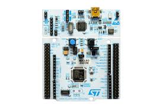
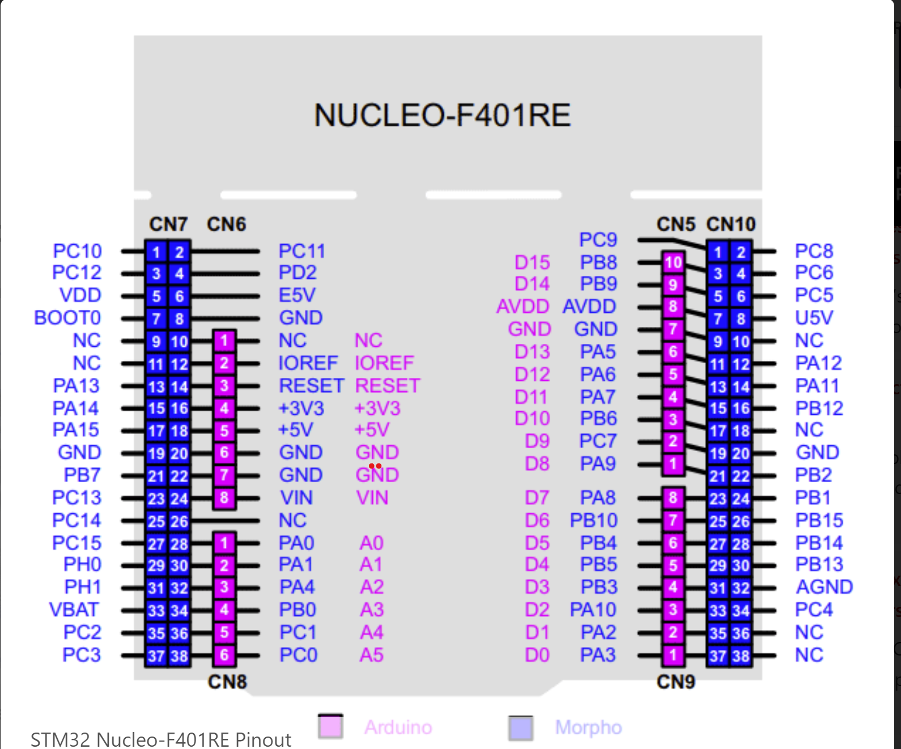

# STM32 Nucleo-F401RE — Mappa GPIO Morpho

<!-- Se l'SVG è nella stessa cartella del .md: -->

> **Scheda:** NUCLEO-F401RE · STMicroelectronics  
> **MCU:** STM32F401RET6 · ARM Cortex-M4 + FPU · 84 MHz · 512 KB Flash · 96 KB SRAM · LQFP64  
> **Connettori:** Morpho CN7 (2×19) · Morpho CN10 (2×19) · Arduino CN5/CN6/CN8/CN9  
> ⚠️ Verificare sempre il datasheet ufficiale ST UM1724 prima dell'uso in produzione.

---

## Componenti onboard rilevanti

| Componente | Pin | Note |
|---|---|---|
| LD2 — LED verde utente | PA5 | Condiviso con SPI1_SCK e D13 |
| B1 — Pulsante utente | PC13 | Attivo basso, EXTI13 |
| LD1 — LED verde COM ST-LINK | — | Indica attività USB/UART |
| LD3 — LED rosso Power | — | Indica alimentazione presente |
| RST — Reset (B2) | NRST | Reset hardware MCU |
| XTAL HSE | PH0 / PH1 | Oscillatore esterno 8 MHz |
| XTAL LSE | PC14 / PC15 | Oscillatore 32.768 kHz (RTC) |
| ST-LINK MCU | — | STM32F103CBT6, gestisce debug/VCP |
| CN4 — SWD | PA13 / PA14 | Debug: SWDIO, SWCLK |

---

## PORT A

| Pin | Connettore | Categoria | Funzioni alternate |
|---|---|---|---|
| PA0 | A0 / CN8 (Arduino) | ADC | ADC1_IN0 · TIM2_CH1 · TIM5_CH1 · WKUP |
| PA1 | A1 / CN8 (Arduino) | ADC | ADC1_IN1 · TIM2_CH2 · TIM5_CH2 · USART2_RTS |
| PA2 | D1 / CN9 (Arduino) | UART | USART2_TX · TIM2_CH3 · ADC1_IN2 |
| PA3 | D0 / CN9 (Arduino) | UART | USART2_RX · TIM2_CH4 · ADC1_IN3 |
| PA4 | A2 / CN8 (Arduino) | ADC | ADC1_IN4 · DAC_OUT1 · SPI1_NSS · USART2_CK |
| PA5 | D13 / LED / CN5 (Arduino) | SPI | SPI1_SCK · TIM2_CH1 · DAC_OUT2 |
| PA6 | D12 / CN5 (Arduino) | SPI | SPI1_MISO · TIM3_CH1 · TIM13_CH1 |
| PA7 | D11 / CN5 (Arduino) | SPI | SPI1_MOSI · TIM3_CH2 · TIM14_CH1 |
| PA8 | D7 / CN9 (Arduino) | GPIO | TIM1_CH1 · I2C3_SCL · MCO1 · USART1_CK |
| PA9 | D8 / CN5 (Arduino) | UART | USART1_TX · TIM1_CH2 · I2C3_SMBA |
| PA10 | D2 / CN9 (Arduino) | UART | USART1_RX · TIM1_CH3 · OTG_FS_ID |
| PA11 | CN10 (Morpho) | GPIO | TIM1_CH4 · CAN1_RX · OTG_FS_DM · USART1_CTS |
| PA12 | CN10 (Morpho) | GPIO | TIM1_ETR · CAN1_TX · OTG_FS_DP · USART1_RTS |
| PA13 | CN7 (SWD) | **DEBUG ⚠️** | SWDIO · JTMS — **non usare durante il debug** |
| PA14 | CN7 (SWD) | **DEBUG ⚠️** | SWCLK · JTCK — **non usare durante il debug** |
| PA15 | CN7 (Morpho) | SPI | JTDI · SPI1_NSS · SPI3_NSS · TIM2_CH1 · I2S3_WS |

---

## PORT B

| Pin | Connettore | Categoria | Funzioni alternate |
|---|---|---|---|
| PB0 | A3 / CN8 (Arduino) | ADC | ADC1_IN8 · TIM1_CH2N · TIM3_CH3 |
| PB1 | CN10 (Morpho) | ADC | ADC1_IN9 · TIM1_CH3N · TIM3_CH4 |
| PB2 | CN10 (Morpho) | GPIO | BOOT1 · GPIO |
| PB3 | D3 / CN9 (Arduino) | PWM | TIM2_CH2 · SPI1_SCK · SPI3_SCK · JTDO |
| PB4 | D5 / CN9 (Arduino) | PWM | TIM3_CH1 · SPI1_MISO · SPI3_MISO · NJTRST |
| PB5 | D4 / CN9 (Arduino) | GPIO | TIM3_CH2 · SPI1_MOSI · I2C1_SMBA |
| PB6 | D10 / CN5 (Arduino) | PWM | TIM4_CH1 · I2C1_SCL · USART1_TX |
| PB7 | CN7 (Morpho) | I2C | TIM4_CH2 · I2C1_SDA · USART1_RX |
| PB8 | CN7 (Morpho) | I2C | I2C1_SCL · TIM4_CH3 · TIM10_CH1 · CAN1_RX · SDIO_D4 |
| PB9 | CN7 (Morpho) | I2C | I2C1_SDA · TIM4_CH4 · TIM11_CH1 · SPI2_NSS · I2S2_WS |
| PB10 | D6 / CN9 (Arduino) | PWM | TIM2_CH3 · I2C2_SCL · SPI2_SCK · USART3_TX |
| PB12 | CN10 (Morpho) | SPI | SPI2_NSS · I2S2_WS · TIM1_BKIN · I2C2_SMBA |
| PB13 | CN10 (Morpho) | SPI | SPI2_SCK · I2S2_CK · TIM1_CH1N |
| PB14 | CN10 (Morpho) | SPI | SPI2_MISO · TIM1_CH2N · TIM12_CH1 |
| PB15 | CN10 (Morpho) | SPI | SPI2_MOSI · I2S2_SD · TIM1_CH3N · TIM12_CH2 |

---

## PORT C

| Pin | Connettore | Categoria | Funzioni alternate |
|---|---|---|---|
| PC0 | A5 / CN8 (Arduino) | ADC | ADC1_IN10 |
| PC1 | A4 / CN8 (Arduino) | ADC | ADC1_IN11 · SPI2_MOSI |
| PC2 | CN7 (Morpho) | ADC | ADC1_IN12 · SPI2_MISO · I2S2ext_SD |
| PC3 | CN7 (Morpho) | ADC | ADC1_IN13 · SPI2_MOSI · I2S2_SD |
| PC4 | CN10 (Morpho) | ADC | ADC1_IN14 |
| PC5 | CN10 (Morpho) | ADC | ADC1_IN15 · USART3_RX |
| PC6 | CN10 (Morpho) | UART | TIM3_CH1 · USART6_TX · SDIO_D6 · I2S2_MCK |
| PC7 | D9 / CN5 (Arduino) | PWM | TIM3_CH2 · USART6_RX · SDIO_D7 · I2S3_MCK |
| PC8 | CN10 (Morpho) | GPIO | TIM3_CH3 · USART6_CK · SDIO_D0 · TIM8_CH3 |
| PC9 | CN10 (Morpho) | GPIO | TIM3_CH4 · I2C3_SDA · MCO2 · SDIO_D1 |
| PC10 | CN7 (Morpho) | UART | USART3_TX · UART4_TX · SPI3_SCK · SDIO_D2 |
| PC11 | CN7 (Morpho) | UART | USART3_RX · UART4_RX · SPI3_MISO · SDIO_D3 |
| PC12 | CN7 (Morpho) | SPI | SPI3_MOSI · USART3_CK · UART5_TX · SDIO_CK |
| PC13 | CN7 — Pulsante B1 | GPIO | GPIO_Input · EXTI13 · RTC_AF1 |
| PC14 | CN7 — OSC32 | OSC | OSC32_IN · LSE (32.768 kHz) |
| PC15 | CN7 — OSC32 | OSC | OSC32_OUT · LSE (32.768 kHz) |

---

## PORT D / PORT H

| Pin | Connettore | Categoria | Funzioni alternate |
|---|---|---|---|
| PD2 | CN7 (Morpho) | UART | UART5_RX · TIM3_ETR · SDIO_CMD |
| PH0 | CN7 — OSC | OSC | OSC_IN · HSE (8 MHz) |
| PH1 | CN7 — OSC | OSC | OSC_OUT · HSE (8 MHz) |

---

## Riepilogo per periferica

### SPI

| Bus | SCK | MISO | MOSI | NSS |
|---|---|---|---|---|
| SPI1 (principale) | PA5 (D13) | PA6 (D12) | PA7 (D11) | PA4 o PB6 (soft) |
| SPI1 (alternativo) | PB3 | PB4 | PB5 | PA15 |
| SPI2 | PB13 | PB14 | PB15 | PB12 |
| SPI3 | PC10 | PC11 | PC12 | PA15 |

> ⚠️ PA5 (SPI1_SCK) è condiviso con il LED LD2: durante la comunicazione SPI il LED lampeggerà.

### I2C

| Bus | SCL | SDA |
|---|---|---|
| I2C1 (principale) | PB8 | PB9 |
| I2C1 (alternativo) | PB6 | PB7 |
| I2C2 | PB10 | — |
| I2C3 | PA8 | PC9 |

### UART / USART

| Periferica | TX | RX | Note |
|---|---|---|---|
| USART2 | PA2 (D1) | PA3 (D0) | **VCP ST-LINK** — collegata al PC via USB |
| USART1 | PA9 (D8) | PA10 (D2) | Disponibile su Arduino header |
| USART3 | PC10 | PC11 | Solo Morpho CN7 |
| USART6 | PC6 | PC7 (D9) | TX solo Morpho, RX su Arduino |
| UART4 | PC10 | PC11 (alt USART3) | Solo Morpho CN7 |
| UART5 | PC12 | PD2 | Solo Morpho CN7 |

> ⚠️ PA2/PA3 (USART2) sono la porta VCP collegata all'ST-LINK: usarli come GPIO interrompe la comunicazione seriale con il PC.

### ADC (ADC1)

| Canale | Pin | Connettore |
|---|---|---|
| IN0 | PA0 | A0 / CN8 |
| IN1 | PA1 | A1 / CN8 |
| IN2 | PA2 | D1 / CN9 |
| IN3 | PA3 | D0 / CN9 |
| IN4 | PA4 | A2 / CN8 |
| IN5 | PA5 | D13 / CN5 |
| IN6 | PA6 | D12 / CN5 |
| IN7 | PA7 | D11 / CN5 |
| IN8 | PB0 | A3 / CN8 |
| IN9 | PB1 | CN10 |
| IN10 | PC0 | A5 / CN8 |
| IN11 | PC1 | A4 / CN8 |
| IN12 | PC2 | CN7 |
| IN13 | PC3 | CN7 |
| IN14 | PC4 | CN10 |
| IN15 | PC5 | CN10 |

### PWM (principali canali timer)

| Timer | Canale | Pin | Connettore |
|---|---|---|---|
| TIM2 | CH2 | PB3 | D3 / CN9 |
| TIM2 | CH3 | PB10 | D6 / CN9 |
| TIM3 | CH1 | PB4 | D5 / CN9 |
| TIM3 | CH2 | PC7 | D9 / CN5 |
| TIM4 | CH1 | PB6 | D10 / CN5 |
| TIM14 | CH1 | PA7 | D11 / CN5 |

---

## Note importanti

- **PA13 / PA14** sono fisicamente su CN7 ma collegati all'ST-LINK (SWD). Usarli come GPIO disabilita la sessione di debug.
- **PA5 (D13 / LD2 / SPI1_SCK)** è un pin triuso: LED, SPI clock e Arduino D13. Gestire i conflitti nel codice.
- **PA2 / PA3 (D1/D0 — USART2)** sono la VCP (Virtual COM Port) dell'ST-LINK: disconnetterli dal monitor seriale prima di usarli come GPIO.
- **PC14 / PC15 / PH0 / PH1** sono pin oscillatore: rimappabili come GPIO solo se si rinuncia ai clock LSE/HSE esterni (richiede modifica ai jumper SB).
- **PB2 (BOOT1)** normalmente è a massa tramite pull-down: verificare il valore del solder bridge prima dell'uso.
- **PA11 / PA12** espongono il bus USB OTG FS (D− / D+): disponibili come GPIO se non si usa USB device.

---

*Generato da Claude · DAC Informatica S.r.l. · Riferimento: ST UM1724 — STM32 Nucleo-64 boards user manual*
